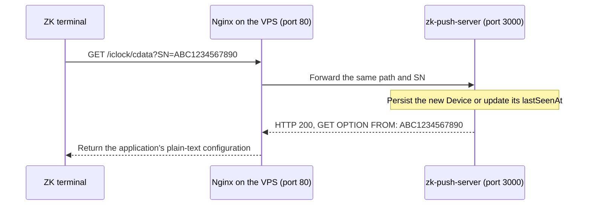

# Connect a physical terminal

The terminal needs firmware supporting ADMS/PUSH. Menu names and available
address/HTTPS settings vary by model. ZKTeco describes cloud-server address and
port settings, including firmware-specific domain configuration, in its
[official FAQ](https://zkteco.com/en/faq). Use the manual for the target model.

## Address and port

1. Start the server and apply migrations using the root README.
2. Find the server host's address that the terminal can reach over its network.
3. Open the device's COMM/Cloud Server Settings or ADMS section. Set the server
   address and port; select HTTP/HTTPS according to the reachable endpoint.
4. If the firmware provides separate IP/port fields, enter the host and port
   separately. Domain mode on some firmware combines them as `zk.example.com:80`;
   enable its domain option when required by the model's manual.
5. Watch server logs for the serial's first handshake or poll. A valid SN
   automatically creates an enabled Device. Confirm/update its metadata and
   `enabled` flag through Prisma Studio.

For direct local development the published application port is 3000. Use the
computer's reachable LAN address and port 3000. `localhost` on the terminal
would mean the terminal itself; Docker service names such as `app` resolve only
inside the Docker network. The terminal constructs `/iclock/cdata`,
`/iclock/getrequest`, and `/iclock/devicecmd`; those paths must reach this server.

Examples with separate fields:

| Setup | Server address | Port |
|---|---|---|
| Direct server | Your server computer's LAN address | 3000 |
| HTTP proxy | `zk.example.com` | 80 |
| HTTPS proxy, compatible firmware | `zk.example.com` | 443 |

HTTPS requires an HTTPS endpoint; the Nest application listens on HTTP. A TLS
proxy may terminate HTTPS and forward to that application. Verify the model's
HTTPS support and settings using its manual. Hostname DNS and the device's
gateway must make the chosen address reachable.

## VPS example: route the first contact to the application

Suppose `zk.example.com` resolves to your VPS, Nginx listens publicly on port 80,
and zk-push-server is running on that VPS at `127.0.0.1:3000` with migrations
applied. Configure the terminal's ADMS server address as `zk.example.com` and
its public server port as `80`, using the field format supported by its firmware.

The VPS must forward every `/iclock/*` request to the zk-push-server application,
preserving the HTTP method, body, path and query string, including `SN`. The
Nginx configuration below provides that routing.



This handshake is the first contact: the terminal initiates the HTTP request,
the proxy routes it to the application, and the application registers the
serial and returns its configuration through the same HTTP connection. A new
Device is enabled automatically; an existing disabled Device returns 403.
Polling, attendance uploads and command results then follow the same VPS route.
The application also recognizes a device if its first request is a poll or
upload rather than a handshake.

Verify the public route from a computer that can reach the VPS, replacing the
example domain with yours:

```bash
curl -i 'http://zk.example.com/iclock/cdata?SN=ABC1234567890'
```

Expect HTTP 200 and a plain-text body beginning with
`GET OPTION FROM: ABC1234567890`. This synthetic check registers that example
SN. When the real terminal connects, its firmware sends its own SN; verify that
serial in Device and confirm its `lastSeenAt` advances. Use the public port
configured on the proxy, which may differ from the application's internal port.

## Preserve protocol routes through a proxy

This example assumes Nginx runs on the server host, where the application is
published on port 3000:

```nginx
server {
    listen 80;
    server_name zk.example.com;

    location /iclock/ {
        client_max_body_size 25m;
        proxy_pass http://127.0.0.1:3000;
        proxy_http_version 1.1;
        proxy_set_header Host $host;
    }
}
```

`proxy_pass` has no URI suffix, so `/iclock/*` and the query string reach the
application unchanged. See [Nginx's proxy_pass documentation](https://nginx.org/en/docs/http/ngx_http_proxy_module.html#proxy_pass).
If Nginx is itself in the Compose network, its upstream can instead be
`http://app:3000`. Ensure the selected public port reaches the proxy and its
body limit permits protocol uploads. This snippet routes terminal requests;
configure the administrative API separately when it is needed remotely.

The application currently records the connection IP and does not trust forwarded
headers by default. Through a proxy, that stored IP is the proxy's connection IP.

## Webhook address is a separate connection

```text
Terminal -- /iclock/* --> zk-push-server -- signed POST --> consuming application
```

`WEBHOOK_URL` is the consuming application's event handler. Do not enter it as
the terminal's ADMS address. A reverse proxy forwards terminal HTTP requests to
this server; the outbox worker later sends selected application events to the
configured webhook destination.

## Check a connection

```bash
curl -i 'http://localhost:3000/iclock/cdata?SN=ABC1234567890'
curl -i 'http://localhost:3000/iclock/getrequest?SN=ABC1234567890'
docker compose logs -f app
```

These synthetic requests register their own device. For a physical device,
look for its connection in your local logs and Device table. A 403 means its
stored enabled flag is false. A 500 means the server could not finish processing;
inspect local server logs. If no request arrives, check the configured address,
port, DNS/network path, and protocol mode for that model.
